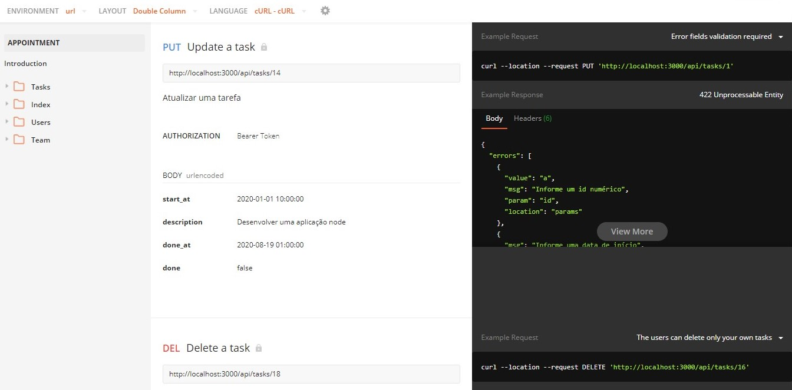

# APPointment

##### Controle suas tarefas e tenha gestão do seu tempo

## BASE URL:

#### https://app-appointment.herokuapp.com/api/

###### Tecnologias

- NodeJS
- Express.JS
- JavaScript
- JasonWebToken
- Moment
- PostgresSQL
- Sequelize
- Express Validator

##### Testes realizados via

1. Jest
2. Postman

##### Clone este projeto

###### Requisitos

> sequelize cli,

> banco de dados PostgresSQL

> Postman para acessar as rotas

- `git clone https://github.com/ALESSANDROLMENEZES/APPointment.git`
- `cd APPointment`
- `npm install`
- `Crie um arquivo .env`
- `Configure o arquivo .env com seu usuário e senha de conexão do banco de dados`
- `npx sequelize db:create`
- `npx sequelize db:migrate`
- `npx sequelize db:seed:all`
- `npm start`
- `Primeiro acesse a rota cadastro para fazer seu cadastro`
- `Você receberá um token, utilize-o para acessar as demais rotas`

###### Acesse a API

[Clique aqui](https://app-appointment.herokuapp.com/ "Api heroku")

[Acesse a documentação](https://web.postman.co/collections/9702967-278dd71f-4826-4a65-8074-15ba2aeb086d?version=latest&workspace=99ecdfd7-fccb-4e1b-869f-b47f7650364e#210c43cb-433a-4f01-b46f-7776e73c6a7d "Acesse a documentação")

